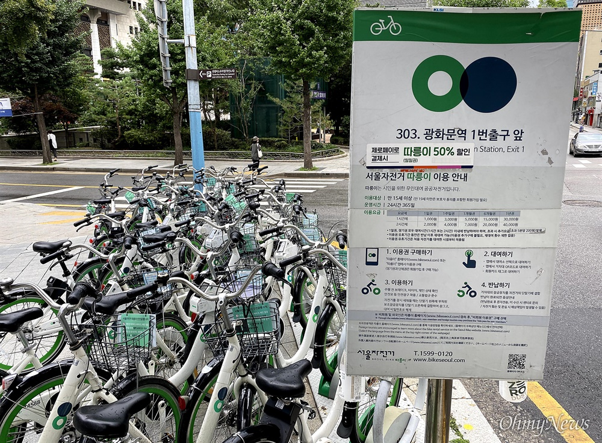
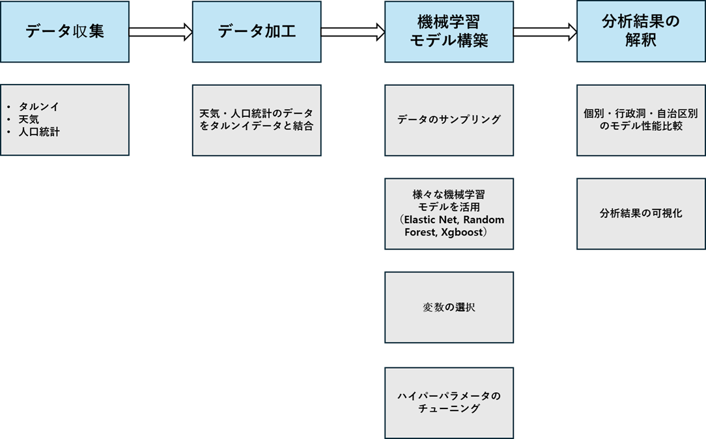
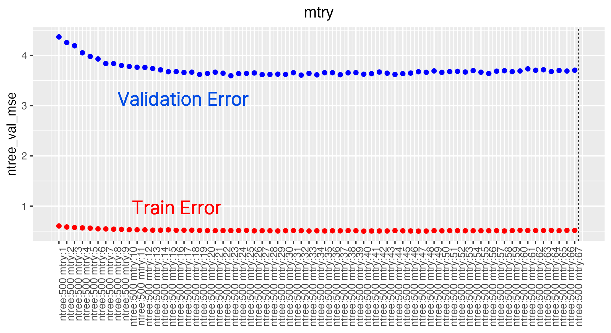
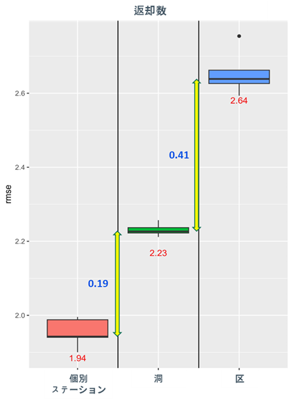

# 🚲 個別・行政洞・自治区レベルにおけるタルンイ需要予測分析

ソウル市の公共自転車サービスである **タルンイ（따릉이）** の需要を予測することで、自転車貸出所の運営効率を高め、都市環境の改善に貢献することを目的としたプロジェクトです。個別貸出所、行政洞、自治区単位でモデルを比較・分析し、最適な予測単位を模索します。

---

## 💻 技術スタック

- **言語**: R
- **使用ライブラリ**:
  - **データ処理**: `dplyr`
  - **機械学習**: `randomForest`, `xgboost`
  - **可視化**: `ggplot2`, `cowplot`, `gridExtra`
- **データ提供元**: [ソウル市公共データポータル](https://data.seoul.go.kr/dataList/5/literacyView.do)

---

## 📑 目次

1. [プロジェクト紹介](#1-プロジェクト紹介)  
   1.1 [背景](#11-背景)  
   1.2 [研究目的](#12-研究目的)  
2. [プロジェクト概要](#2-プロジェクト概要)  
   2.1 [データ収集](#21-データ収集)  
   2.2 [データ加工](#22-データ加工)  
   2.3 [機械学習モデル構築](#23-機械学習モデル構築)  
   2.4 [分析結果](#24-分析結果)  

---

## 1. プロジェクト紹介

### 1.1 背景

  
> タルンイ返却量の偏り状況

ソウル市は公共自転車「タルンイ」を運営しており、都市内の移動手段を多様化し、環境に優しい交通手段の拡充を目指しています。しかし、特定の地域では貸出量と返却量の不均衡により、自転車の過剰堆積や不足が発生し、景観の悪化や市民の不便につながっています。この問題を解決するために、精度の高い需要予測が求められています。

### 1.2 研究目的

- タルンイの需要量（貸出量および返却量）の予測  
- 予測モデルを **個別貸出所**、**行政洞**、**自治区** 単位で構築し、その性能を比較  
- モデル運用にかかるコストと精度のバランスを考慮し、最適な単位を選定

---

## 2. プロジェクト概要

###   
> プロジェクトのワークフロー

### 2.1 データ収集

- **収集データ**: タルンイの貸出および返却履歴  
- **補助変数**: 天気情報、生活人口、公共交通利用量  

### 2.2 データ加工

- 貸出・返却履歴を **貸出量／返却量形式に変換**  
- 貸出所の位置情報に基づいて、天気や人口データを **マッチング**

### 2.3 機械学習モデル構築

#### サンプリング戦略

- 全データを使用するにはプロジェクトの制約があったため、大学が位置する **広津区（クァンジング）** をターゲット地域に選定  
- 広津区内の **個別貸出所50カ所のうち11カ所** をサンプリングして分析を実施

#### 使用モデルと特徴

| モデル        | 特徴                          |
|---------------|-------------------------------|
| Elastic Net    | 線形モデル（L1 + L2 正則化）    |
| Random Forest  | 非線形モデル、バギング方式       |
| XGBoost        | 非線形モデル、ブースティング方式 |

#### 変数選定

| モデル                 | 変数選定方法                             |
|------------------------|------------------------------------------|
| Elastic Net            | ステップワイズ変数選択                   |
| Random Forest / XGBoost| Feature Importanceが0.1%未満の変数を除外 |

#### ハイパーパラメータチューニング

  
> Random Forestのハイパーパラメータチューニング例

- ハイパーパラメータは、バリデーションエラーの減少が鈍化する地点を基準に決定

### 2.4 分析結果

  
> 貸出所・行政洞・自治区単位別の予測精度比較

- **精度比較結果**:
  - 個別貸出所 > 行政洞 > 自治区の順に予測精度が高い

#### 結論

- 個別単位モデルは高い精度を示す一方で、運用・保守の負担が大きい  
- 自治区単位モデルは精度が低く、実用性に欠ける  
- 精度とコストのバランスを考慮し、プロジェクトの目的と条件に適したモデルの選定が重要

